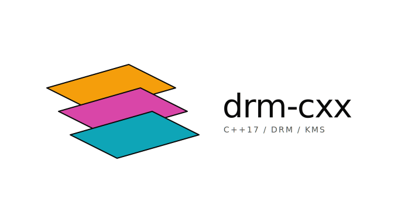

C++17 library for Linux DRM/KMS display, input, and hardware plane allocation. Adapter headers (`drm::expected`, `drm::span`, `drm::print`) alias the standard types on C++23 toolchains and `tl::expected` / `tcb::span` / `fmt::print` on older ones.

## Features

- RAII wrappers for DRM devices, dumb buffers, GBM buffers, libinput contexts, and xkbcommon state.
- `drm::expected<T, E>` on every fallible operation.
- **`drm::scene::LayerScene`** — handle-based layer model with allocator-driven plane assignment, session pause/resume, and a CPU composition fallback for layers the hardware can't fit.
- **Native plane allocator** with bipartite pre-solve, warm-start across frames, failure memoization, content-type priority, and spatial group splitting. Replaces libliftoff.
- **`drm::cursor`** — XCursor theme resolver and KMS cursor renderer with runtime rotation and `HOTSPOT_X/Y` virtualization.
- **`drm::session::Seat`** — libseat-backed session multiplexer over logind / seatd / builtin (gated on `DRM_CXX_SESSION`).
- **`drm::display::HotplugMonitor`** — udev netlink hotplug stream with connector-id fast-path.
- **`drm::capture`** — Blend2D-backed CRTC plane-composition snapshot with PNG encode (gated on `DRM_CXX_BLEND2D`).
- Atomic modeset builder around `drmModeAtomicCommit`.
- libinput / xkbcommon input with typed event variants and `std::function` dispatch.
- EDID parsing via libdisplay-info (colorimetry, HDR, EOTFs).
- GBM device / surface / buffer with DMA-BUF.
- Optional `VK_KHR_display` Vulkan support.
- `drm::print` logging with runtime `LogLevel` gating.

## Requirements

| Tool | Minimum |
|------|---------|
| GCC | 9 (13.1 for native `std::expected` / `std::print`) |
| Clang | 10 (16.0 for native `std::expected` / `std::print`) |
| Meson | 1.3.0 |
| CMake | 3.21 |
| libdrm | 2.4.113 |
| libgbm | any |
| libinput | 1.21 |
| xkbcommon | 1.5 |
| libdisplay-info | 0.1.1 (subproject) |
| libseat | 0.7 (optional, for `DRM_CXX_SESSION`) |
| libxcursor | any (optional, for `DRM_CXX_CURSOR`) |
| Blend2D | 0.10 (optional, for `DRM_CXX_BLEND2D`) |
| ThorVG | 1.0.4 (optional, for the `thorvg_janitor` example) |
| Vulkan-Headers | 1.3 (optional) |

## Building

Meson:

```sh
meson setup builddir
ninja -C builddir
meson test -C builddir
```

CMake:

```sh
cmake -B build -G Ninja
cmake --build build
ctest --test-dir build
```

### Options

| Meson | CMake | Default | Description |
|-------|-------|---------|-------------|
| `vulkan` | `DRM_CXX_VULKAN` | on | `VK_KHR_display` support |
| `examples` | `DRM_CXX_BUILD_EXAMPLES` | on | Example programs |
| `tests` | `DRM_CXX_BUILD_TESTS` | on | Unit + integration tests |
| `session` | `DRM_CXX_SESSION` | auto | `drm::session::Seat` (libseat) |
| `cursor` | `DRM_CXX_CURSOR` | auto | `drm::cursor` (libxcursor) |
| `blend2d` | `DRM_CXX_BLEND2D` | auto | `drm::capture` + `drm::csd` (Blend2D) |
| `thorvg_janitor` | `DRM_CXX_BUILD_THORVG_JANITOR` | auto | `thorvg_janitor` example (ThorVG) |

## Usage

### Single header

```cpp
#include <drm-cxx/drm-cxx.hpp>
```

### LayerScene

```cpp
auto dev = drm::Device::open("/dev/dri/card0").value();
dev.enable_universal_planes();
dev.enable_atomic();

drm::scene::LayerScene::Config cfg{crtc_id, connector_id, mode};
auto scene = drm::scene::LayerScene::create(dev, cfg).value();

auto bg = drm::scene::DumbBufferSource::create(dev, w, h, DRM_FORMAT_ARGB8888).value();
// ... fill bg->pixels() ...

drm::scene::LayerDesc desc;
desc.source = std::move(bg);
desc.display.dst_rect = {0, 0, w, h};
auto handle = scene->add_layer(std::move(desc)).value();

auto report = scene->commit().value();
// report.layers_assigned / layers_composited / layers_unassigned
```

### Raw plane allocation

```cpp
auto registry = drm::planes::PlaneRegistry::enumerate(dev).value();

drm::planes::Layer comp_layer;
drm::planes::Output output(crtc_id, comp_layer);

auto& layer = output.add_layer();
layer.set_property("FB_ID", fb_id)
     .set_property("CRTC_X", 0).set_property("CRTC_Y", 0)
     .set_property("CRTC_W", 1920).set_property("CRTC_H", 1080);

drm::planes::Allocator allocator(dev, registry);
drm::AtomicRequest req(dev);
auto assigned = allocator.apply(output, req, 0).value();
```

### Input

```cpp
auto seat = drm::input::Seat::open().value();
auto keyboard = drm::input::Keyboard::create({.layout = "us"}).value();

seat.set_event_handler([&](const drm::input::InputEvent& ev) {
  if (auto* ke = std::get_if<drm::input::KeyboardEvent>(&ev)) {
    keyboard.process_key(*ke);
    drm::println("Key {}: sym=0x{:x} utf8='{}'", ke->key, ke->sym, ke->utf8);
  }
});
```

### EDID

```cpp
auto info = drm::display::parse_edid(edid_blob).value();
if (info.hdr) {
  drm::println("HDR: max={}cd/m²", info.hdr->max_luminance);
}
```

### Logging

```cpp
drm::set_log_level(drm::LogLevel::Debug);
drm::log_info("Device opened: {}", path);
```

Compile-time floor: `-DDRM_CXX_LOG_LEVEL=4`.

## Migration from drmpp

| drmpp | drm-cxx |
|-------|---------|
| `drmpp::` namespace | `drm::` |
| `#include <drmpp/drmpp.h>` | `#include <drm-cxx/drm-cxx.hpp>` |
| `int` errno returns | `drm::expected<T, std::error_code>` |
| `spdlog::info(...)` | `drm::log_info(...)` or `drm::println(...)` |
| `liftoff_output_apply()` | `allocator.apply(output, req, flags)` |
| `liftoff_layer_set_property()` | `layer.set_property(name, value)` |
| `liftoff_layer_needs_composition()` | `layer.needs_composition()` |
| libsync `sync_wait()` | `drm::sync::SyncFence::wait()` |
| bsdrm helpers | `drm::get_resources()`, `drm::get_connector()`, etc. |
| Virtual callback classes | `std::function<>` handlers |

## License

MIT
